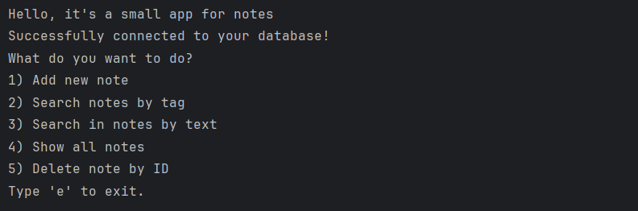
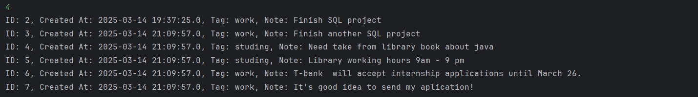
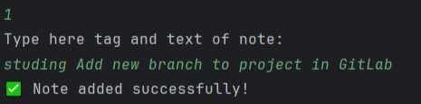
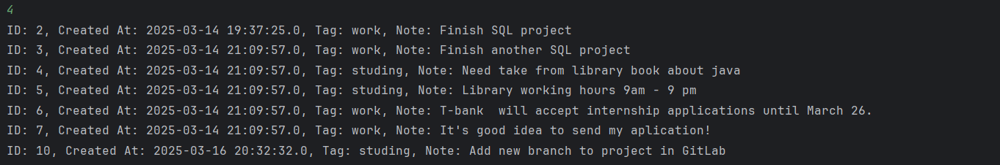
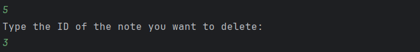
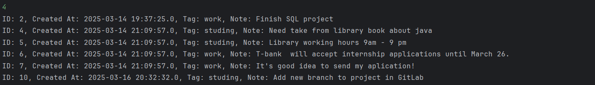
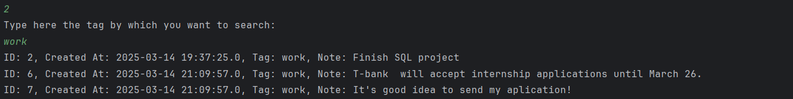
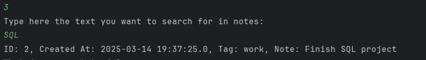

# Notes app pet project

Hello there! It's my small project that use SQL and java (also there are python version) to contain, adding, searching and deleting notes.

In the case of sucsessful compiling you see something like this:

Let's see how looks out local data base right now:

## Adding new note

Try add new note:

And let's look all notes now:

## Deleting note

Try delete some note by his ID:

Now all notes looks like this:

## Searching notes

We can look only for notes with "work" category:

Or we can look notes that contains "SQL" in yourself:

It's all in functionality of project now. In future I want to connect web part!